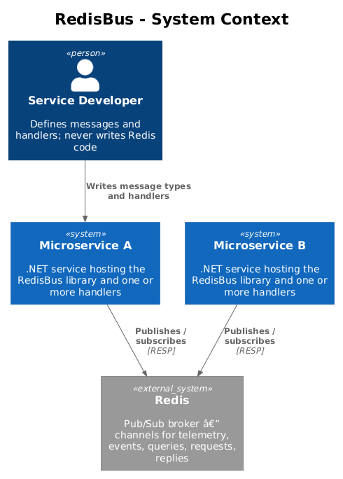
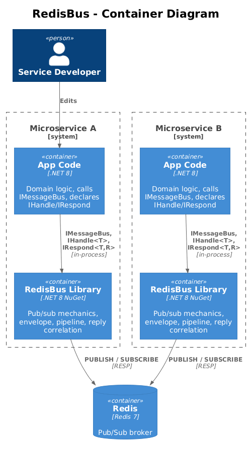
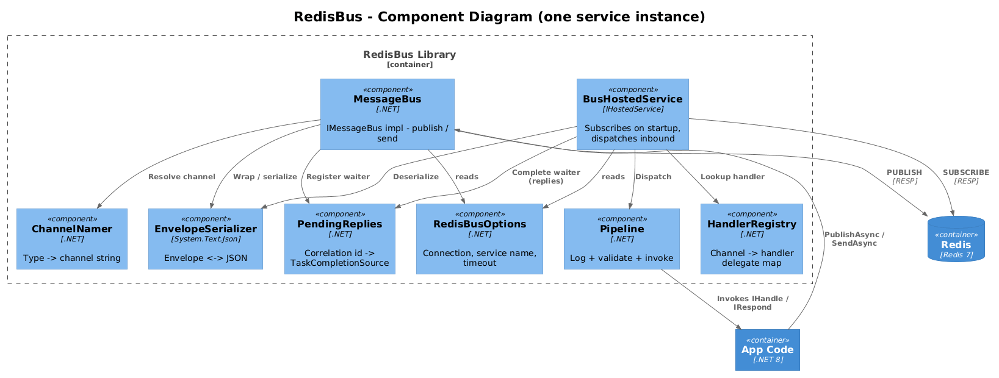
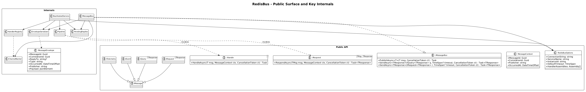
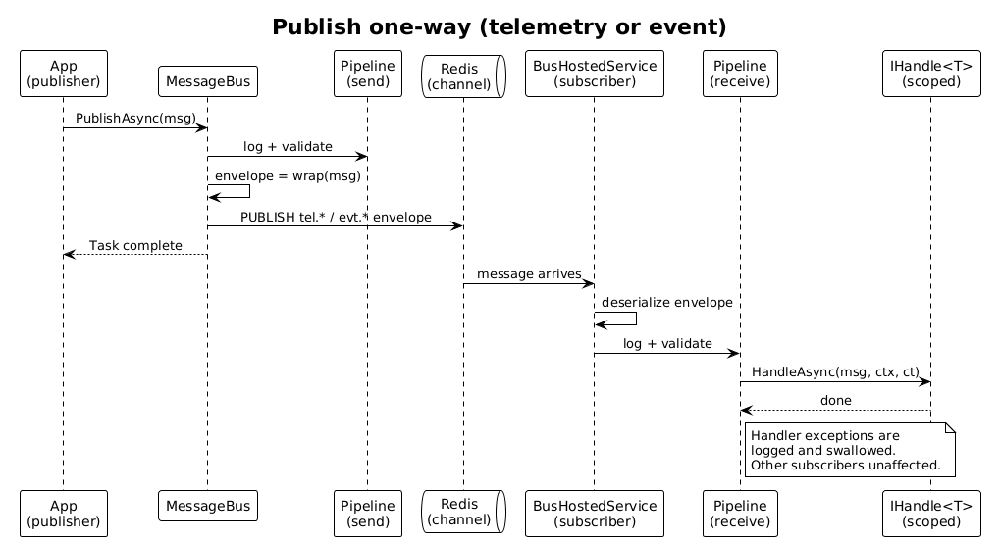
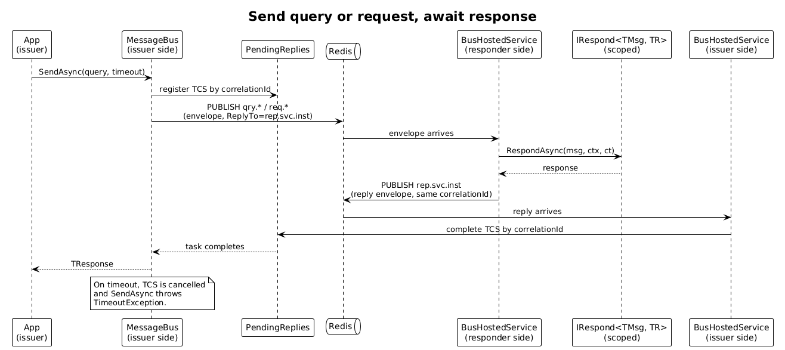

# Messaging Library (RedisBus) — Detailed Design

## 1. Overview

`RedisBus` is the small common library that every microservice in this reference application takes a dependency on. It hides the mechanics of Redis Pub/Sub behind a tiny surface so that an application developer can declare a message type, register a handler, and never write Redis code.

It supports the four patterns described in `docs/idea.md`:

| Pattern | Direction | Marker | Channel prefix |
|---|---|---|---|
| Telemetry | one-way fan-out | `ITelemetry` | `tel.*` |
| Event | one-way fan-out | `IEvent` | `evt.*` |
| Query / response | request → reply (read) | `IQuery<TResponse>` | `qry.*` → `rep.*` |
| Request / response | request → reply (write) | `IRequest<TResponse>` | `req.*` → `rep.*` |

Telemetry and events use the same wire mechanism (publish to a named channel, fan out to every subscriber); query and request use the same wire mechanism (publish to a named channel, the issuer waits on a per-instance reply channel for a correlated response). The four interfaces exist solely so that semantics is visible at the call site — the library treats them uniformly underneath.

**Goals:**
- Define a message → write a handler → done. No Redis APIs in service code.
- Cross-cutting logging and DataAnnotations validation applied to every message in and out, with no per-handler boilerplate.
- A surface a new developer can learn in fifteen minutes.

**Non-goals (explicit):**
- Durable delivery, replay, or competing consumers — Redis Pub/Sub is fire-and-forget, and this library does not paper over that. See §8.
- Schema evolution, message versioning, or backwards-compatible payload migration. The reference app uses POCOs; production users will layer their own discipline on top.
- A pluggable pipeline. Logging and validation are baked in. Extension only when a real second use case demands it.

## 2. Architecture

### 2.1 C4 Context

How the library sits inside a microservice and talks to peers through Redis.



### 2.2 C4 Container

The technical building blocks — service host, the library, and the Redis broker.



### 2.3 C4 Component

Internal components of the library inside one service.



## 3. Component Details

### 3.1 `MessageBus` (implements `IMessageBus`)
- **Responsibility**: The single entry point application code calls. `PublishAsync` for telemetry/events, `SendAsync` for queries/requests.
- **Interfaces**: `Task PublishAsync<T>(T msg, CancellationToken)` where `T : IMessage`; `Task<TResponse> SendAsync<TResponse>(IQuery<TResponse> q, TimeSpan? timeout, CancellationToken)`; same overload for `IRequest<TResponse>`.
- **Dependencies**: `IConnectionMultiplexer` (StackExchange.Redis), `ChannelNamer`, `EnvelopeSerializer`, `PendingReplies`, `RedisBusOptions`, `ILogger<MessageBus>`.
- **Behavior**:
  - `PublishAsync` resolves channel name from the message type, wraps in an envelope, validates, logs, and `ISubscriber.PublishAsync`.
  - `SendAsync` allocates a correlation id, registers a `TaskCompletionSource<TResponse>` in `PendingReplies`, publishes the request envelope with `ReplyTo = "rep.{serviceName}.{instanceId}"`, and awaits the TCS with a timeout (default 5 seconds, overridable per call and per options).

### 3.2 `BusHostedService` (implements `IHostedService`)
- **Responsibility**: On service startup, subscribes the Redis client to every channel for which a handler or responder has been registered, plus the single per-instance reply channel `rep.{serviceName}.{instanceId}`.
- **Dependencies**: `IConnectionMultiplexer`, `HandlerRegistry`, `EnvelopeSerializer`, `Pipeline`, `PendingReplies`, `RedisBusOptions`, `ILogger<BusHostedService>`.
- **Behavior**: For each subscription, on message arrival it dispatches the envelope through the receive `Pipeline`. Reply-channel messages bypass the handler dispatch and complete a pending TCS instead.

### 3.3 `HandlerRegistry`
- **Responsibility**: Builds, at DI build time, the map from channel name → invoker delegate. One registration per `IHandle<T>` and per `IRespond<TQuery, TResponse>` discovered by `AddRedisBusHandlers(Assembly)`.
- **Dependencies**: `IServiceProvider` (to resolve scoped handlers per dispatch), `ChannelNamer`.
- **Behavior**: The registry stores precompiled delegates that, given an envelope, resolve a scoped service, deserialize the payload, and invoke the handler.

### 3.4 `Pipeline`
- **Responsibility**: Wraps every send and every dispatch in a fixed order: log → validate → invoke. On exception, log + propagate (for sends) or log + drop (for one-way receives) or log + send error reply (for query/request receives).
- **Dependencies**: `ILogger<Pipeline>`, `IServiceProvider` (for scoped handler resolution).
- **Behavior**: Validation uses `System.ComponentModel.DataAnnotations.Validator.TryValidateObject`. Validation failures throw `MessageValidationException` on the publish side; on the receive side they yield an error reply for queries/requests or are logged and dropped for telemetry/events.

### 3.5 `PendingReplies`
- **Responsibility**: Tracks in-flight `SendAsync` calls keyed by correlation id. Completes the TCS when a reply envelope arrives on the per-instance reply channel; cancels the TCS on timeout.
- **Dependencies**: none (pure in-memory).
- **Behavior**: A `ConcurrentDictionary<Guid, IReplyWaiter>`. Each `SendAsync` registers a waiter, awaits its task, and removes the entry on completion or timeout.

### 3.6 `EnvelopeSerializer`
- **Responsibility**: Serializes/deserializes `MessageEnvelope` and its `Payload` using `System.Text.Json`. The `Type` field on the envelope is the assembly-qualified CLR type name; the deserializer resolves the runtime type and round-trips the payload.
- **Dependencies**: none.

### 3.7 `ChannelNamer`
- **Responsibility**: Computes a channel name from a message type and the marker interface it implements. `tel.<short-name>`, `evt.<short-name>`, `qry.<short-name>`, `req.<short-name>`. The short name is `<Namespace.Last>.<TypeName>`, which avoids collisions across services without requiring per-message attributes.
- **Dependencies**: none.

### 3.8 `RedisBusOptions`
- **Responsibility**: Configuration record — `ConnectionString`, `ServiceName`, `InstanceId` (defaults to `Guid.NewGuid()` per process), `DefaultTimeout` (5 s), `HandlerAssemblies` (filled by `AddRedisBusHandlers`).

## 4. Data Model

### 4.1 Class Diagram

The user-facing surface (top half) and key internal collaborators (bottom half).



### 4.2 Envelope

Every message on the wire is JSON in this shape:

```json
{
  "messageId": "8c4e…",
  "correlationId": "8c4e…",
  "replyTo": "rep.api-gateway.7f9a",
  "type": "Building.Contracts.Queries.GetRoomStatus, Building.Contracts",
  "occurredAt": "2026-05-04T14:22:31.117Z",
  "publisher": "api-gateway",
  "payload": { "roomId": "R-101" }
}
```

- `replyTo` is set only on queries and requests. Reply envelopes carry the same `correlationId` and a `payload` of the response type.
- `type` is the assembly-qualified CLR type name. Receivers without that assembly drop the message and log a warning.

### 4.3 Channel naming

| Pattern | Example type | Channel |
|---|---|---|
| Telemetry | `Sensor.Contracts.TemperatureReading` | `tel.Contracts.TemperatureReading` |
| Event | `Building.Contracts.RoomOccupancyChanged` | `evt.Contracts.RoomOccupancyChanged` |
| Query | `Building.Contracts.GetRoomStatus` | `qry.Contracts.GetRoomStatus` |
| Request | `Control.Contracts.SetThermostat` | `req.Contracts.SetThermostat` |
| Reply (per-instance) | n/a | `rep.{serviceName}.{instanceId}` |

The deliberate choice: a fixed naming convention beats per-message `[Channel("…")]` attributes for "radical simplicity." Convention is uniform; attributes drift.

## 5. Key Workflows

### 5.1 Publish a telemetry or event message

The fire-and-forget path. Identical for `ITelemetry` and `IEvent`.



1. App calls `bus.PublishAsync(msg)`.
2. `MessageBus` resolves the channel name, validates the payload, wraps in an envelope, logs, and calls `ISubscriber.PublishAsync(channel, json)`.
3. Redis fans out to every subscriber. Each subscriber's `BusHostedService` receives, deserializes, runs the receive pipeline (log → validate), resolves a scoped handler, and invokes `HandleAsync`. Exceptions inside the handler are logged and swallowed; one bad subscriber does not affect others.

### 5.2 Send a query or request and await a response

The correlated request/reply path. Identical for `IQuery<T>` and `IRequest<T>`.



1. App calls `bus.SendAsync(query)`.
2. `MessageBus` allocates a correlation id, registers a TCS in `PendingReplies`, publishes the envelope with `ReplyTo = "rep.{serviceName}.{instanceId}"`, and `await`s the TCS task with timeout.
3. The responder service's `BusHostedService` receives the request envelope on `qry.<TypeName>`, runs the receive pipeline, resolves the scoped `IRespond<TQuery, TResponse>`, calls `RespondAsync`, wraps the result in a reply envelope (same correlation id), and publishes it to the `ReplyTo` channel.
4. The issuer's `BusHostedService` is subscribed to its own `rep.{serviceName}.{instanceId}` channel. On reply arrival it looks up the correlation id in `PendingReplies` and completes the TCS, which unblocks the original `SendAsync`.
5. On timeout, the TCS is cancelled and the call throws `TimeoutException` — the issuer never blocks indefinitely. Late replies arrive at an empty waiter slot and are logged + dropped.

## 6. Public API (call-site surface)

```csharp
// 1. Define a message — POCO with a marker interface
public sealed record TemperatureReading(
    [Required] string SensorId,
    [Range(-50, 100)] double Celsius,
    DateTimeOffset At) : ITelemetry;

public sealed record GetRoomStatus([Required] string RoomId) : IQuery<RoomStatus>;
public sealed record RoomStatus(string RoomId, double TempC, int Occupants);

public sealed record SetThermostat(
    [Required] string DeviceId,
    [Range(10, 30)] double TargetC) : IRequest<SetThermostatAck>;
public sealed record SetThermostatAck(string DeviceId, double EffectiveC);

// 2. Write a handler or responder
public class TemperatureReadingLogger : IHandle<TemperatureReading>
{
    public Task HandleAsync(TemperatureReading m, MessageContext ctx, CancellationToken ct)
        => /* … */ Task.CompletedTask;
}

public class GetRoomStatusResponder : IRespond<GetRoomStatus, RoomStatus>
{
    public Task<RoomStatus> RespondAsync(GetRoomStatus q, MessageContext ctx, CancellationToken ct)
        => /* … */;
}

// 3. Compose at startup
builder.Services.AddRedisBus(o =>
{
    o.ConnectionString = "redis:6379";
    o.ServiceName      = "building";
});
builder.Services.AddRedisBusHandlers(typeof(Program).Assembly);

// 4. Use anywhere
RoomStatus s = await bus.SendAsync(new GetRoomStatus("R-101"));
await bus.PublishAsync(new TemperatureReading("S-1", 21.5, DateTimeOffset.UtcNow));
```

The full type vocabulary a developer touches:

- Markers: `IMessage`, `ITelemetry`, `IEvent`, `IQuery<T>`, `IRequest<T>`
- Handlers: `IHandle<T>`, `IRespond<TMessage, TResponse>`
- Bus: `IMessageBus`
- Context: `MessageContext` (carries `MessageId`, `CorrelationId`, `Publisher`, `OccurredAt`)
- Options: `RedisBusOptions`
- Extensions: `AddRedisBus(…)`, `AddRedisBusHandlers(Assembly)`

That is the entire surface. Ten public types.

## 7. Cross-Cutting Concerns

### 7.1 Logging
Every publish and every receive emits a single structured `ILogger` event with `MessageId`, `CorrelationId`, `Type`, `Channel`, and on receive `LatencyMs` (envelope `OccurredAt` to handler-entry). Failures log at `Warning` (validation, deserialization, handler exception) or `Error` (transport failures). The library does not invent its own log abstraction — it uses `Microsoft.Extensions.Logging.ILogger<T>`.

### 7.2 Validation
DataAnnotations on the message record. `Validator.TryValidateObject` runs in the pipeline both pre-publish and post-deserialize. Choosing DataAnnotations over FluentValidation keeps the dependency graph minimal; if a service genuinely needs a richer rule, it can validate inside its handler.

## 8. Constraints & Open Questions

- **Pub/Sub is fire-and-forget.** No retention, no replay, no acks. If a subscriber is offline when a message is published, it never sees it. This is an explicit constraint on the reference application — the four patterns demonstrate the *shape* of inter-service communication, not durable delivery.
- **Multiple instances of a query/request responder service receive every request.** With pure Pub/Sub, every subscriber gets every message. For one-way (telemetry/event) that is the desired fan-out. For query/request the issuer takes the first reply (TCS completes once); duplicate work is silently wasted. **Recommendation for the reference app:** run exactly one instance of each responder service. Production users wanting horizontal scaling of responders should layer Redis Streams with consumer groups for `qry.*` and `req.*` channels — out of scope for this design.
- **Slow consumers and broker memory.** Redis Pub/Sub buffers per-subscriber; a sufficiently slow subscriber gets disconnected by Redis. The library does not currently surface this beyond the underlying `ConnectionMultiplexer` events. Open: should the library log subscriber disconnects loudly?
- **Reply channel after a timeout.** Late replies are dropped silently; we log a warning. Open: should we expose a counter so dashboards can detect responder regressions?
- **Schema evolution.** Adding a non-nullable property to a message record is a breaking change. Reference app pins all six services to the same `Contracts` package version. Open: when this becomes a real production concern, do we adopt a `MessageVersion` field on the envelope?
