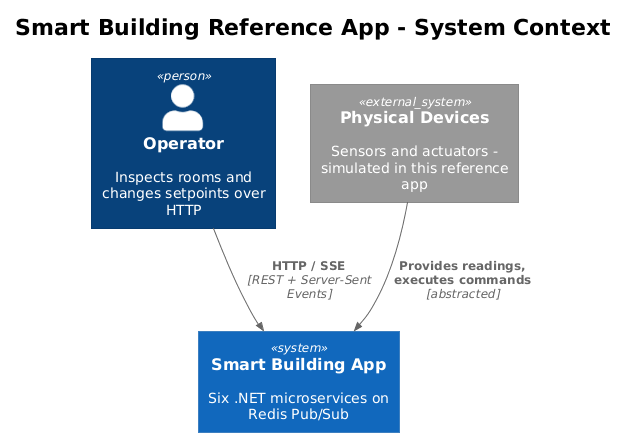
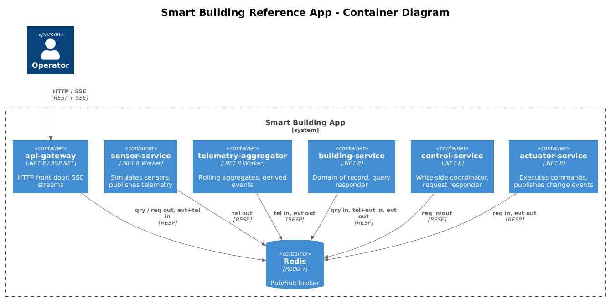
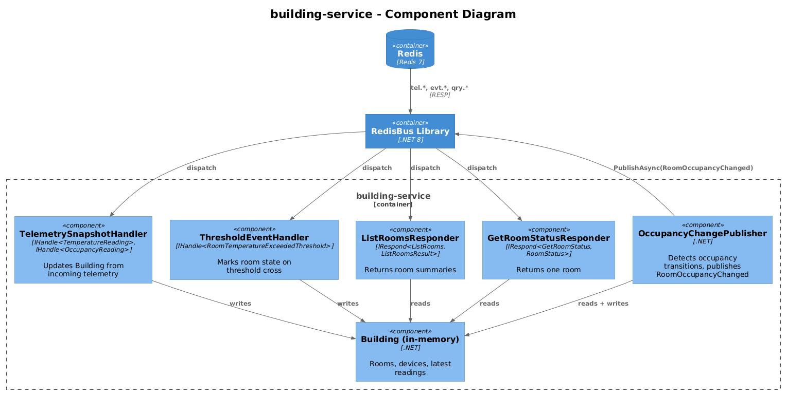
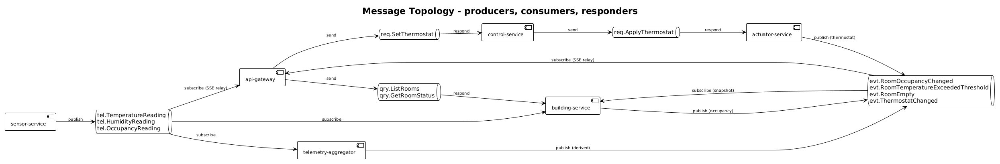
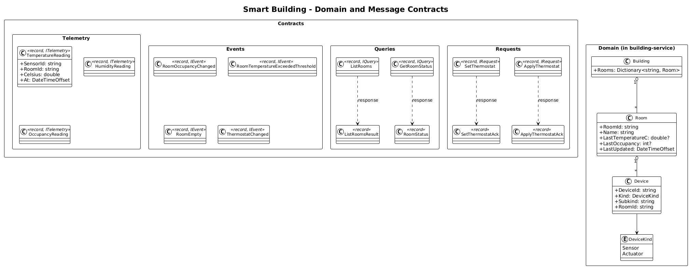
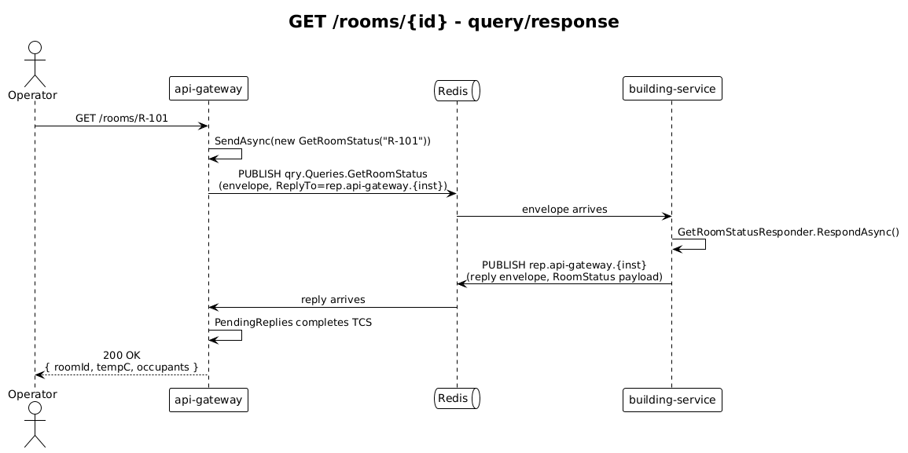
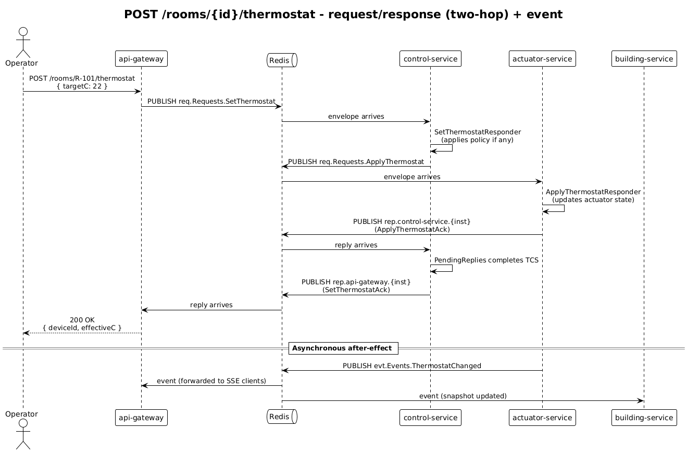

# Reference Application — Smart Building — Detailed Design

## 1. Overview

A six-service .NET reference application that exemplifies every pattern provided by the [RedisBus library](../01-messaging-library/README.md). The chosen domain — a smart building with sensors, rooms, and actuators — is realistic enough to make the patterns distinct without inviting domain complexity that would distract from them.

**Why this domain?** Each of the four message patterns has a clear, non-overlapping purpose:
- **Telemetry** — high-volume sensor readings flowing from one producer to many consumers (the canonical fan-out)
- **Events** — discrete state changes (`RoomOccupancyChanged`, `ThermostatChanged`) broadcast from the service that owns the change
- **Queries** — read-side lookups (`GetRoomStatus`) where one issuer expects exactly one response
- **Requests** — write-side commands (`SetThermostat`) where the issuer waits for an acknowledgement that the side effect happened

The application is a teaching tool. Its job is to give a new developer a place to point and say "that is what telemetry looks like; that is what a query looks like." It is not production-grade and explicitly skips persistence, authentication, and durability concerns the four patterns are not about.

**Actors:**
- **Operator** — a human (or curl) calling the API Gateway over HTTP to inspect rooms or change a setpoint
- **Physical Device** — abstracted away; simulated inside `SensorService` and `ActuatorService`

**Out of scope:** persistence (everything is in-memory), authn/authz, multi-tenant routing, actual hardware integration.

## 2. Architecture

### 2.1 C4 Context

### 2.2 C4 Container

The six services and the broker.

### 2.3 C4 Component — Building Service (canonical example)

The Building Service is the most representative service: it consumes telemetry and events, owns domain state, responds to queries, and publishes its own events. The other five follow the same shape with fewer responsibilities.

### 2.4 Topology — who publishes / subscribes / responds to what

A reference application's most useful artifact is a single picture of message flow across all services. This diagram shows publishers (▶), subscribers (◀), and responders (●) per channel.

## 3. Service Details

Each service is a `.NET 8` `WebApplication` (or `Host` for non-HTTP services), takes `RedisBus` as a NuGet dependency, references a shared `Contracts` package containing message records, and registers its handlers with `AddRedisBusHandlers`.

### 3.1 `api-gateway`
- **Responsibility**: HTTP front door. Translates HTTP calls into queries and requests; streams telemetry and events to clients via Server-Sent Events.
- **HTTP endpoints**: `GET /rooms`, `GET /rooms/{id}`, `POST /rooms/{id}/thermostat`, `GET /stream/telemetry` (SSE), `GET /stream/events` (SSE).
- **Bus role**: Issues `ListRooms` and `GetRoomStatus` queries; issues `SetThermostat` requests; subscribes to all `tel.*` and `evt.*` channels and forwards their JSON envelopes to connected SSE clients.
- **Owns**: nothing — it is stateless.

### 3.2 `sensor-service`
- **Responsibility**: Simulates physical sensors (temperature, humidity, occupancy) for a configured set of rooms.
- **Bus role**: Publishes `TemperatureReading`, `HumidityReading`, and `OccupancyReading` (`ITelemetry`) at a configured cadence. No handlers, no responders.
- **Owns**: in-memory simulation parameters per sensor.

### 3.3 `telemetry-aggregator`
- **Responsibility**: Subscribes to telemetry, computes rolling aggregates (5-minute averages), and emits derived events when thresholds are crossed.
- **Bus role**: `IHandle<TemperatureReading>` etc.; publishes `RoomTemperatureExceededThreshold` and `RoomEmpty` (`IEvent`). Pure consumer + event publisher; no responders.
- **Owns**: in-memory aggregate windows per room/sensor.

### 3.4 `building-service`
- **Responsibility**: Domain of record for rooms, sensors, and actuators. Resolves queries about current state.
- **Bus role**: `IRespond<ListRooms, ListRoomsResult>`, `IRespond<GetRoomStatus, RoomStatus>`. Subscribes to all sensor telemetry and to `RoomTemperatureExceededThreshold` to update its in-memory snapshot. Publishes `RoomOccupancyChanged` when occupancy transitions.
- **Owns**: an in-memory `Building` aggregate (rooms, devices, latest readings).

### 3.5 `control-service`
- **Responsibility**: Coordinates write-side flows. Today it is a thin pass-through for thermostat setpoint changes; in production it would enforce policy (rate limits, safety interlocks).
- **Bus role**: `IRespond<SetThermostat, SetThermostatAck>` — receives a `SetThermostat` from the gateway, sends `ApplyThermostat` (`IRequest<ApplyThermostatAck>`) downstream to `actuator-service`, returns the result.
- **Owns**: nothing — pass-through with optional policy hooks.

### 3.6 `actuator-service`
- **Responsibility**: Executes physical commands (simulated). Owns the truth about what each actuator's last applied state is.
- **Bus role**: `IRespond<ApplyThermostat, ApplyThermostatAck>`. Publishes `ThermostatChanged` (`IEvent`) on each successful apply.
- **Owns**: in-memory actuator state per device.

## 4. Data Model

Domain entities live inside `building-service` (and a snapshot also in `actuator-service`). Messages live in a shared `Contracts` library referenced by every service.

### 4.1 Class Diagram

### 4.2 Entities

- **`Room`** — `RoomId`, `Name`, `Devices`, `LastTemperatureC`, `LastOccupancy`, `LastUpdated`.
- **`Device`** — `DeviceId`, `Kind` (Sensor or Actuator), `Subkind` (Thermostat, OccupancyDetector, etc.), `RoomId`.
- **`Reading`** (in-memory only) — last value per `(DeviceId, MetricKind)`.
- **`Building`** — collection of `Room` + `Device`, all in-process inside `building-service`.

### 4.3 Message contracts (shared `Contracts` package)

| Pattern | Type | Notes |
|---|---|---|
| Telemetry | `TemperatureReading`, `HumidityReading`, `OccupancyReading` | Annotated with `[Range]` validation |
| Event | `RoomOccupancyChanged`, `RoomTemperatureExceededThreshold`, `ThermostatChanged`, `RoomEmpty` | |
| Query | `ListRooms` → `ListRoomsResult`; `GetRoomStatus` → `RoomStatus` | |
| Request | `SetThermostat` → `SetThermostatAck`; `ApplyThermostat` → `ApplyThermostatAck` | |

The reference app intentionally keeps the message count small — three telemetry, four events, two queries, two requests. The library is designed for the 200+ message volume described in `idea.md`; the reference app proves the patterns, not the volume.

## 5. Key Workflows

### 5.1 Get room status (query)

A read-side lookup. Operator → SPA / curl → API Gateway → Building Service.

### 5.2 Set thermostat (request → request)

A write-side command that traverses two services to demonstrate request/response composition. The gateway's `SetThermostat` is fulfilled by `control-service`, which itself issues an `ApplyThermostat` request to `actuator-service`. The actuator publishes a `ThermostatChanged` event on success, which propagates to subscribers (gateway SSE stream, building service snapshot).

### 5.3 Telemetry → derived event chain

`sensor-service` publishes `TemperatureReading` on a regular cadence. `telemetry-aggregator` and `building-service` both consume it. When the rolling average crosses a threshold, the aggregator publishes `RoomTemperatureExceededThreshold`. The building service updates its snapshot; the gateway forwards both telemetry and events to SSE clients. No sequence diagram — every arrow is the §5.1 of the [library design](../01-messaging-library/README.md#51-publish-a-telemetry-or-event-message).

## 6. HTTP API

| Method | Path | Behavior |
|---|---|---|
| `GET` | `/rooms` | Issues `ListRooms` query → returns array of `RoomSummary` |
| `GET` | `/rooms/{id}` | Issues `GetRoomStatus` query → returns `RoomStatus` |
| `POST` | `/rooms/{id}/thermostat` | Body `{ targetC }` → issues `SetThermostat` request → returns `SetThermostatAck` |
| `GET` | `/stream/telemetry` | SSE stream of every `tel.*` envelope the gateway receives |
| `GET` | `/stream/events` | SSE stream of every `evt.*` envelope the gateway receives |

Bodies and responses are the JSON envelope's `payload` field, not the raw envelope. The gateway is an HTTP-to-bus translator and hides the envelope from external callers.

## 7. Deployment

`docker-compose.yml` runs Redis plus the six services. Each service has the same compose shape: a Dockerfile from `dotnet/sdk` for build and `dotnet/aspnet` for run, an env var for `Redis__ConnectionString`, and a network alias matching its service name. Local development without Docker: `redis-server`, then `dotnet run` each service in its own terminal.

There is no orchestrator, no service mesh, no API gateway library (`api-gateway` is just a normal ASP.NET service that happens to expose HTTP). One Redis instance for the whole reference app — it is fine for the demonstration.

## 8. Open Questions

- **Single instance per responder service.** As called out in the [library design §8](../01-messaging-library/README.md#8-constraints--open-questions), responder services (`building-service`, `control-service`, `actuator-service`) should run a single instance under pure Pub/Sub. Should the reference app explicitly enforce this in `docker-compose.yml` (e.g., `deploy.replicas: 1`) and document why?
- **Should `control-service` be merged into `api-gateway`?** Today it is a near pass-through; it earns its keep only when a real policy layer (rate limits, safety) lives there. Keeping it separate matches the brief's "6 microservices" and demonstrates request/response composition end-to-end, but a reviewer might reasonably argue that pass-through services are clutter. Recommendation: keep it for now, with one demonstrative policy (e.g., reject targets outside 15 °C–28 °C).
- **Telemetry stream from gateway.** SSE keeps the demo trivial. WebSockets would let the gateway accept subscription filters from the browser, but adds protocol surface that does not illustrate any new pattern.
- **Dashboard SPA.** The reference app does not include one. Curl + the SSE streams are sufficient to demonstrate every pattern. If a SPA is later added, it consumes the same gateway endpoints — no service-side changes.
