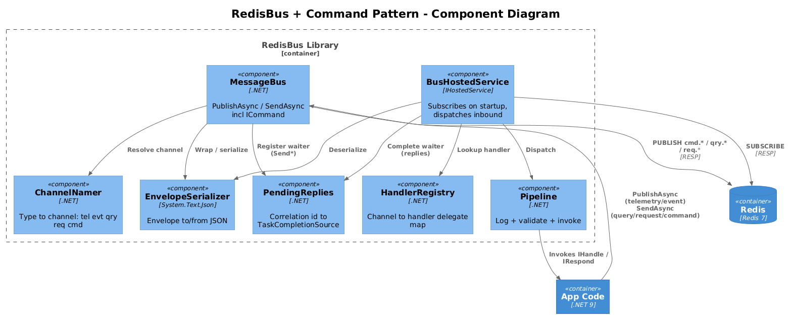
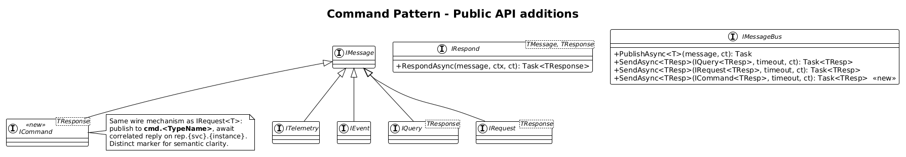
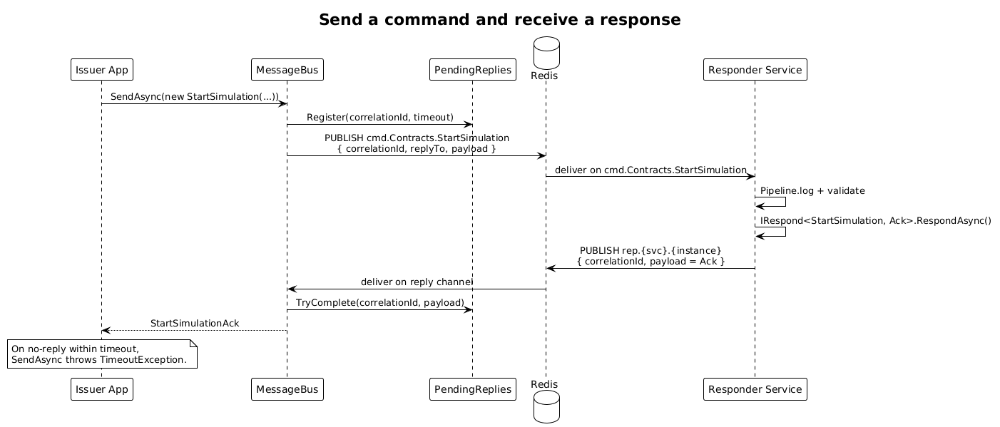

# Command Pattern Extension — Detailed Design

**Status:** Complete

## 1. Overview

Adds a fifth message pattern to RedisBus: **command / command response**. Commands represent *deliberate, write-side intent* — a request that asks a service to perform an action and report the result. Mechanically, commands behave exactly like requests (publish to a channel, receive a single correlated reply on the per-instance reply channel). They carry distinct semantics so handlers, dashboards, and audit tooling can treat them differently from queries (read-side) or generic requests.

The wire mechanism, envelope shape, validation, logging, and timeout behavior are inherited unchanged from [Feature 01](../01-messaging-library/README.md). Only one public interface and one channel prefix are added.

| Pattern | Direction | Marker | Channel prefix |
|---|---|---|---|
| Command (new) | request → reply (write, intentional) | `ICommand<TResponse>` | `cmd.*` → `rep.*` |

## 2. Architecture

Same internal components as Feature 01. The diagram below highlights the addition: `ICommand<T>` flows through the existing `MessageBus` / `HandlerRegistry` / `Pipeline` / `PendingReplies` chain.



## 3. Component Details

### 3.1 `ICommand<TResponse>` (new public type)
- New marker interface. Identical generic-arity contract to `IRequest<TResponse>`.
- Distinguished from `IRequest<T>` only by name and channel prefix — no new envelope fields, no new pipeline stages.

### 3.2 `ChannelNamer` (changed)
Adds the `cmd.*` prefix branch:

```csharp
foreach (var iface in messageType.GetInterfaces())
{
    var def = iface.GetGenericTypeDefinition();
    if (def == typeof(IQuery<>))   return "qry";
    if (def == typeof(IRequest<>)) return "req";
    if (def == typeof(ICommand<>)) return "cmd";   // <-- added
}
```

### 3.3 `IMessageBus` (changed)
Adds one overload that forwards to the existing `SendInternal<TResponse>` path:

```csharp
Task<TResponse> SendAsync<TResponse>(
    ICommand<TResponse> command,
    TimeSpan? timeout = null,
    CancellationToken cancellationToken = default);
```

### 3.4 `HandlerRegistry` (unchanged)
`IRespond<TMessage, TResponse>` already handles every responder marker (`IQuery`, `IRequest`, `ICommand`) uniformly — the registry discovers any implementation of `IRespond<TMsg, TResp>` regardless of which marker `TMsg` implements. No code changes required.

### 3.5 `Pipeline`, `PendingReplies`, `EnvelopeSerializer`, `BusHostedService` (unchanged)
Mechanically identical to Feature 01 — the cmd.* path reuses the same correlation-id / TCS / reply-channel plumbing as qry.* and req.*.

## 4. Data Model

### 4.1 Class Diagram

The user-facing surface, with `ICommand<T>` slotted in alongside the other two correlated patterns.



### 4.2 Channel naming (updated)

| Pattern | Example type | Channel |
|---|---|---|
| Telemetry | `Sensor.Contracts.TemperatureReading` | `tel.Contracts.TemperatureReading` |
| Event | `Building.Contracts.RoomOccupancyChanged` | `evt.Contracts.RoomOccupancyChanged` |
| Query | `Building.Contracts.GetRoomStatus` | `qry.Contracts.GetRoomStatus` |
| Request | `Control.Contracts.SetThermostat` | `req.Contracts.SetThermostat` |
| **Command (new)** | `Sensor.Contracts.StartSimulation` | `cmd.Contracts.StartSimulation` |
| Reply (per-instance) | n/a | `rep.{serviceName}.{instanceId}` |

## 5. Key Workflows

### 5.1 Send a command and receive a response

Identical wire flow to query/request. Channel prefix is the only difference; semantics is what changes (commands are intentful, idempotent-where-possible, audit-relevant).



## 6. Public API addition

```csharp
// Define
public sealed record StartSimulation(
    [property: Required] string Profile) : ICommand<StartSimulationAck>;

public sealed record StartSimulationAck(string SessionId, DateTimeOffset StartedAt);

// Handle (reuses existing IRespond<,>)
public class StartSimulationResponder : IRespond<StartSimulation, StartSimulationAck>
{
    public Task<StartSimulationAck> RespondAsync(
        StartSimulation cmd, MessageContext ctx, CancellationToken ct)
        => Task.FromResult(new StartSimulationAck(Guid.NewGuid().ToString("N"), DateTimeOffset.UtcNow));
}

// Send
var ack = await bus.SendAsync(new StartSimulation("default"));
```

The full vocabulary grows to **eleven public types**: the previous ten plus `ICommand<TResponse>`. Still inside the "fifteen-minute learnability" budget set by Feature 01.

## 7. Open Questions

- **Causation id.** Should commands carry a causation id beyond the existing correlation id, to support audit / event-sourcing chains? Skipped for now; the envelope can grow a `CausationId` field later without breaking existing readers.
- **One-way commands.** Should the library expose a separate `ICommand` (no response) for fire-and-forget commands? `IEvent` already covers one-way flows; if "write-side fire-and-forget" emerges as a real pattern, add it then.
- **Replacing `IRequest<T>` with `ICommand<T>`.** Some projects model every write-side correlated call as a command. Keeping both lets callers choose the marker that best matches their intent; the cost is one extra interface in the public surface.
