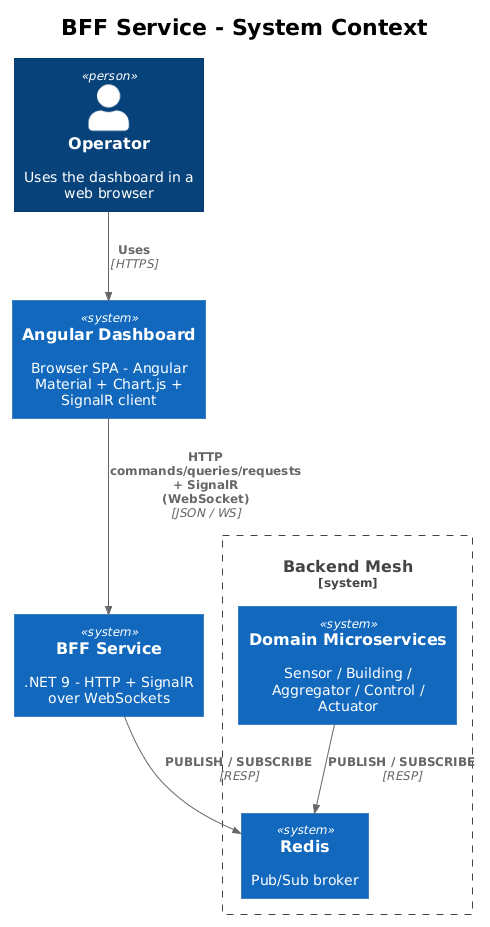
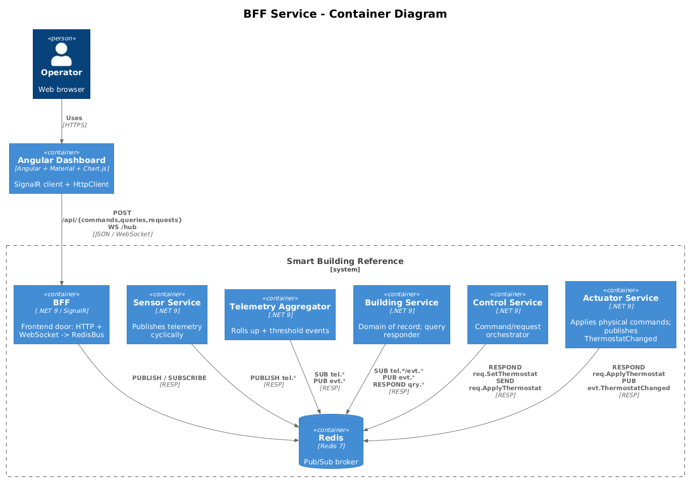
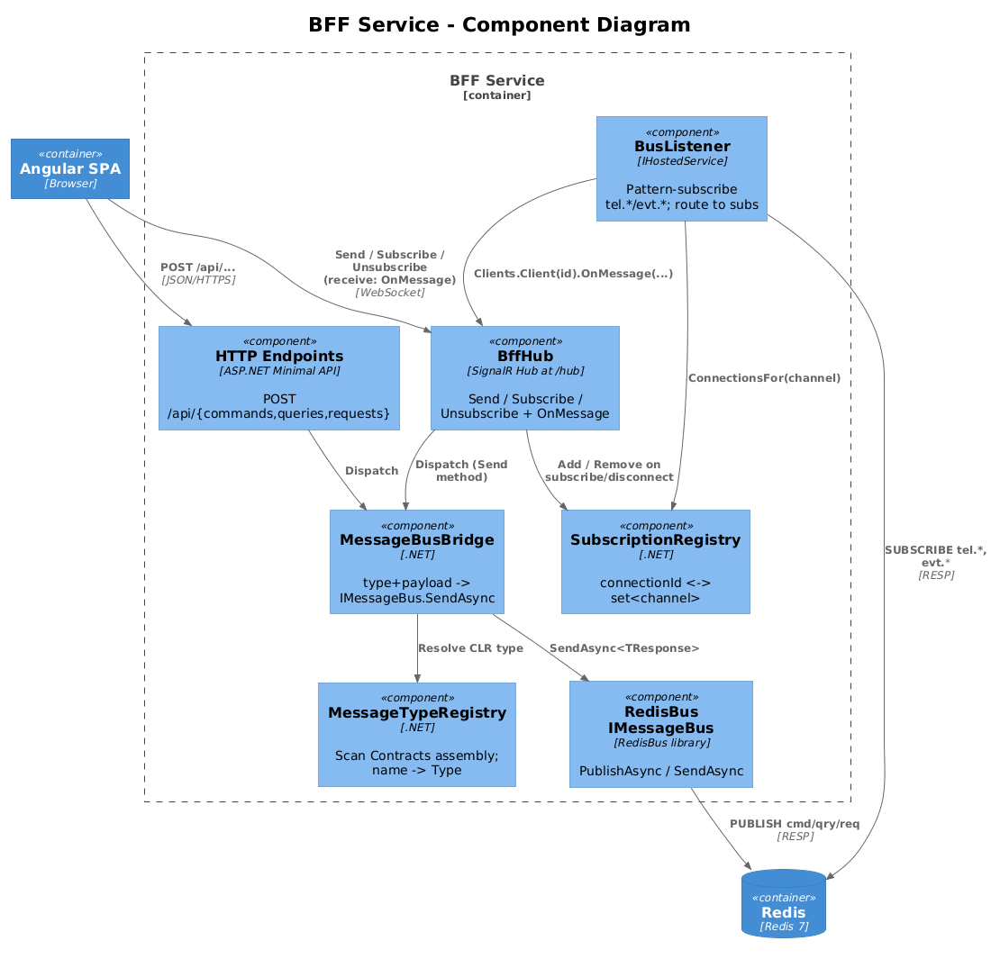
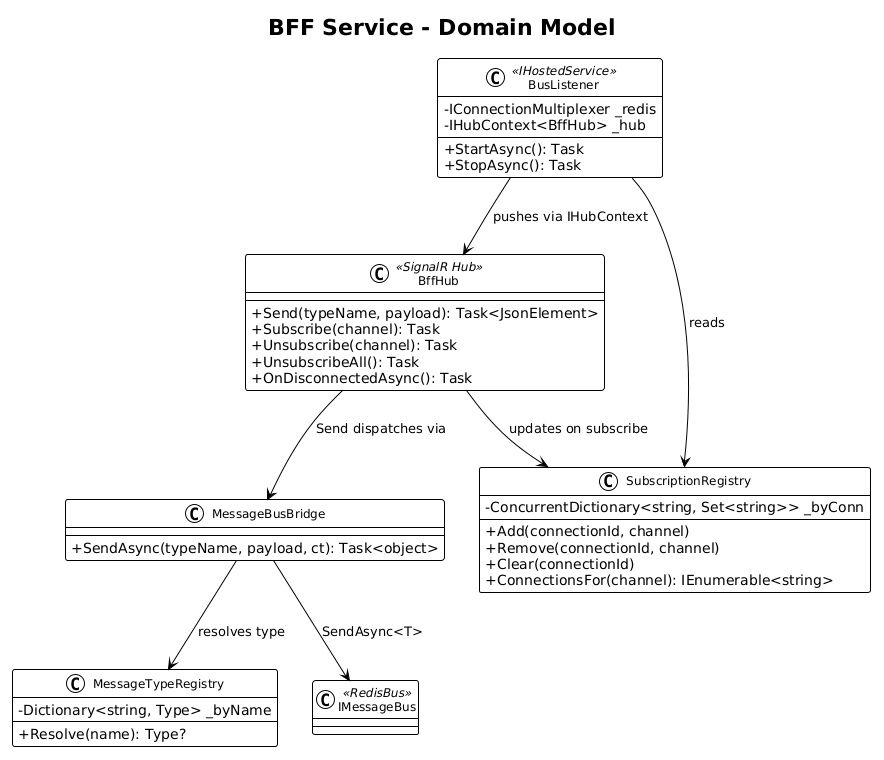
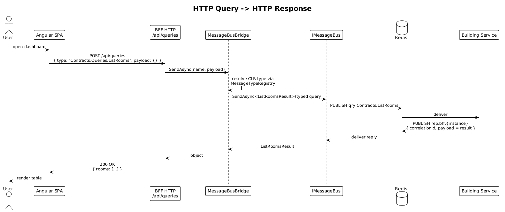
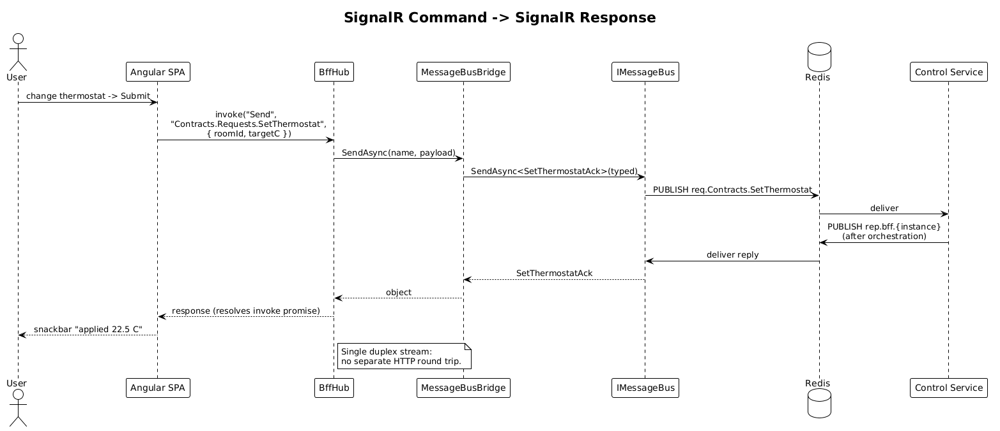
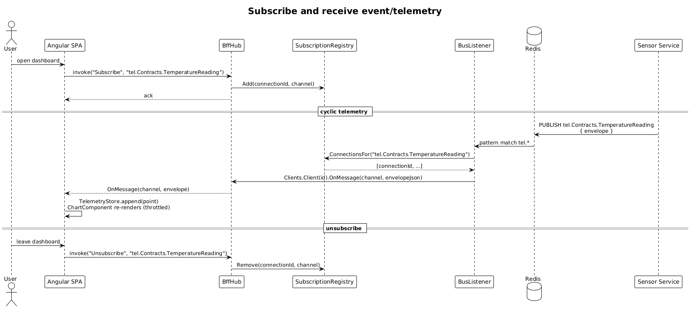

# Backend-for-Frontend (BFF) Service — Detailed Design

**Status:** Accepted

## 1. Overview

A single .NET microservice that the Angular SPA talks to. It is the **only** frontend-facing component of the system: every command, query, request, or subscription the browser issues goes through the BFF. The BFF translates between the browser (HTTP + SignalR over WebSockets) and the rest of the backend (RedisBus over Redis Pub/Sub).

The BFF supersedes the original `ApiGateway` from [Feature 02](../02-reference-application/README.md). It exposes:

- **HTTP endpoints** for commands, queries, and requests, returning the response synchronously in the HTTP body.
- **A SignalR hub** that lets the same operations be sent over the WebSocket connection, with the response delivered as a SignalR message correlated by request id.
- **Per-connection topic subscriptions** so each SignalR client receives only the telemetry / events / messages it has explicitly asked for.

The frontend chooses HTTP or SignalR per call. HTTP is appropriate for one-off operations from REST-shaped client code; SignalR is appropriate when the connection is already open for live updates and a separate HTTP round trip would be wasteful.

**Goals:**
- One frontend door, two delivery channels (HTTP + WebSocket), uniform semantics.
- Selective subscription: a client receives `tel.*`, `evt.*`, and broadcast messages only for the channels it has subscribed to.
- Zero coupling to specific backend services — the BFF is generic over the `Contracts` assembly.

**Non-goals (explicit):**
- Multi-tenant routing.
- Authentication / authorization (see §7).
- Server-side message persistence or replay (Pub/Sub remains fire-and-forget).
- Wildcard / pattern subscriptions (clients name exact channels — see §8).

## 2. Architecture

### 2.1 C4 Context

How the BFF sits between the browser SPA and the rest of the backend.

### 2.2 C4 Container

The BFF inside the broader system, replacing the original `ApiGateway`. The five domain microservices are unchanged.

### 2.3 C4 Component

Internal components of the BFF service.

## 3. Component Details

### 3.1 `BffHub` (`Microsoft.AspNetCore.SignalR.Hub`)
- **Responsibility**: Single SignalR hub mapped at `/hub`. Exposes client-callable methods for sending commands / queries / requests and managing subscriptions; pushes back responses and subscribed messages.
- **Client → server methods**:
  - `Task<JsonElement> Send(string typeName, JsonElement payload)` — used for command / query / request over SignalR. Returns the result inline (SignalR `await connection.invoke`).
  - `Task Subscribe(string channel)` — adds the channel to the current connection's subscription set.
  - `Task Unsubscribe(string channel)` — removes one channel.
  - `Task UnsubscribeAll()` — clears all subscriptions for this connection.
- **Server → client method** (the client implements one handler):
  - `OnMessage(string channel, string envelopeJson)` — invoked once per delivery on a subscribed channel.
- **Lifecycle**: Overrides `OnDisconnectedAsync` to call `SubscriptionRegistry.Clear(connectionId)`.
- **Dependencies**: `MessageBusBridge`, `SubscriptionRegistry`.

### 3.2 `SubscriptionRegistry`
- **Responsibility**: Maps `connectionId` → set of subscribed channel strings, and provides reverse lookup `channel` → set of subscribed connection ids.
- **Operations**:
  - `Add(connectionId, channel)` / `Remove(connectionId, channel)` / `Clear(connectionId)`
  - `ConnectionsFor(channel)` — used by `BusListener` to push to subscribed connections.
- **Storage**: `ConcurrentDictionary<string, ConcurrentDictionary<string, byte>>` keyed by connection id; `byte` is a placeholder value to make a concurrent set.

### 3.3 `BusListener` (`IHostedService`)
- **Responsibility**: At startup, uses `IConnectionMultiplexer` to subscribe to Redis patterns `tel.*` and `evt.*` (plus `cmd.*` if the SPA is allowed to listen to broadcast command notifications). On each arrival, looks up subscribed connections in `SubscriptionRegistry` and pushes the envelope JSON to those connections via `IHubContext<BffHub>`.
- **Dependencies**: `IConnectionMultiplexer`, `SubscriptionRegistry`, `IHubContext<BffHub>`, `ILogger<BusListener>`.

### 3.4 `MessageTypeRegistry`
- **Responsibility**: Resolves a string type name (e.g. `"Contracts.Requests.SetThermostat"`) to a CLR `Type`, by scanning the `Contracts` assembly at startup.
- **Built once** and read-only thereafter; lookup is `Dictionary<string, Type>` O(1).
- Used by HTTP endpoints and `BffHub.Send` to deserialize incoming JSON into the right CLR type before calling `IMessageBus.SendAsync`.

### 3.5 HTTP endpoints
- `POST /api/commands` — body `{ type, payload }` → resolve type → `bus.SendAsync((ICommand<T>)payload)` → 200 with response body.
- `POST /api/queries` — same shape, dispatches `IQuery<T>`.
- `POST /api/requests` — same shape, dispatches `IRequest<T>`.
- All three return:
  - `400 Bad Request` on `MessageValidationException` (with the error list)
  - `404 Not Found` on unresolved type name
  - `504 Gateway Timeout` on `TimeoutException`
  - `200 OK` with the response body otherwise

### 3.6 `MessageBusBridge`
A thin internal helper that, given a string type name + JSON payload, resolves the CLR type via `MessageTypeRegistry`, deserializes the payload, and dispatches via `IMessageBus.SendAsync<TResp>`. Used identically by HTTP endpoints and the SignalR hub so the two surfaces share one code path.

## 4. Data Model

### 4.1 Class Diagram

### 4.2 Subscription state

Subscriptions are **purely in-memory**: nothing is persisted. On disconnect, all subscriptions for the connection are dropped. On reconnect, the client re-subscribes — the BFF does not buffer missed messages (Pub/Sub is fire-and-forget end to end).

The channel string is the **same** name format produced by `ChannelNamer` — e.g. `tel.Contracts.TemperatureReading`, `evt.Contracts.RoomOccupancyChanged`. Clients subscribe with the exact channel name they want to receive.

## 5. Key Workflows

### 5.1 HTTP query → HTTP response

Used when a SignalR connection isn't open or the caller is naturally REST-shaped.

### 5.2 SignalR command → SignalR response

Used when the connection is already open; saves the HTTP round trip and works inside a single duplex stream.

### 5.3 Subscribe and receive event / telemetry

The cyclic-telemetry / live-event flow. The browser subscribes once; thereafter the BFF pushes only matching channels.

## 6. API Contracts

### 6.1 HTTP

| Method | Path | Body | Returns |
|---|---|---|---|
| `POST` | `/api/commands` | `{ "type": string, "payload": object }` | response object \| 400/404/504 |
| `POST` | `/api/queries` | `{ "type": string, "payload": object }` | response object \| 400/404/504 |
| `POST` | `/api/requests` | `{ "type": string, "payload": object }` | response object \| 400/404/504 |

### 6.2 SignalR Hub at `/hub`

| Method (client → server) | Args | Returns |
|---|---|---|
| `Send` | `(typeName: string, payload: object)` | `response: object` (any of command/query/request shapes) |
| `Subscribe` | `(channel: string)` | `void` |
| `Unsubscribe` | `(channel: string)` | `void` |
| `UnsubscribeAll` | `()` | `void` |

| Method (server → client) | Args | Notes |
|---|---|---|
| `OnMessage` | `(channel: string, envelopeJson: string)` | invoked once per delivery on a subscribed channel; the envelope is the same JSON shape Redis sees |

The single `Send` method covers commands, queries, and requests — the marker interface (`ICommand`, `IQuery`, `IRequest`) on the resolved CLR type tells `IMessageBus` which path to take. Clients do not need to know which is which; the type name is sufficient.

## 7. Security

The BFF currently has **no** authentication or authorization. Production users would add ASP.NET Core JWT bearer auth (or Cookie auth for the SPA), an `[Authorize]` attribute on the hub and endpoints, and per-channel ACLs in `SubscriptionRegistry`. The reference app explicitly defers this — the patterns being demonstrated are messaging patterns, not authn patterns.

CORS: a permissive policy is enabled in development to let the Angular app talk to the BFF on a different origin. Production should narrow this to the SPA's actual origin.

## 8. Open Questions

- **Wildcard / pattern subscriptions.** Clients can only subscribe to exact channel names today. Adding `tel.*` would translate into Redis pattern subscribes — left out so the BFF stays predictable about who can listen to what.
- **Subscription cardinality.** No limit on how many channels a single connection may subscribe to. For a teaching tool, fine; for production, a per-connection cap is sensible.
- **Disconnection during in-flight HTTP request via SignalR.** If the client disconnects mid-await, the bus call still completes; the response is dropped. Acceptable for the demo; production may need an idempotency key.
- **Authentication.** Out of scope; placeholder noted in §7.
