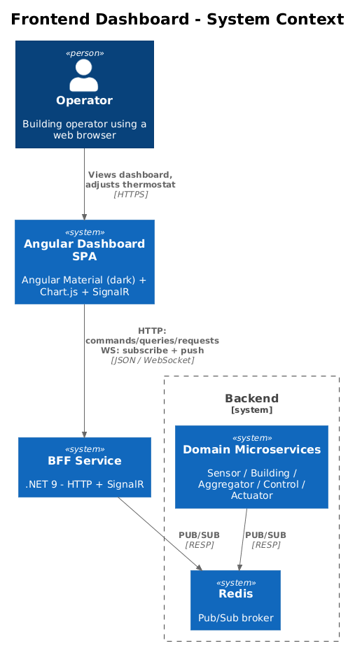
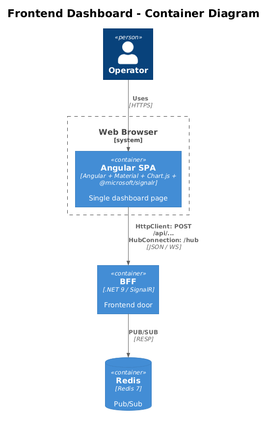
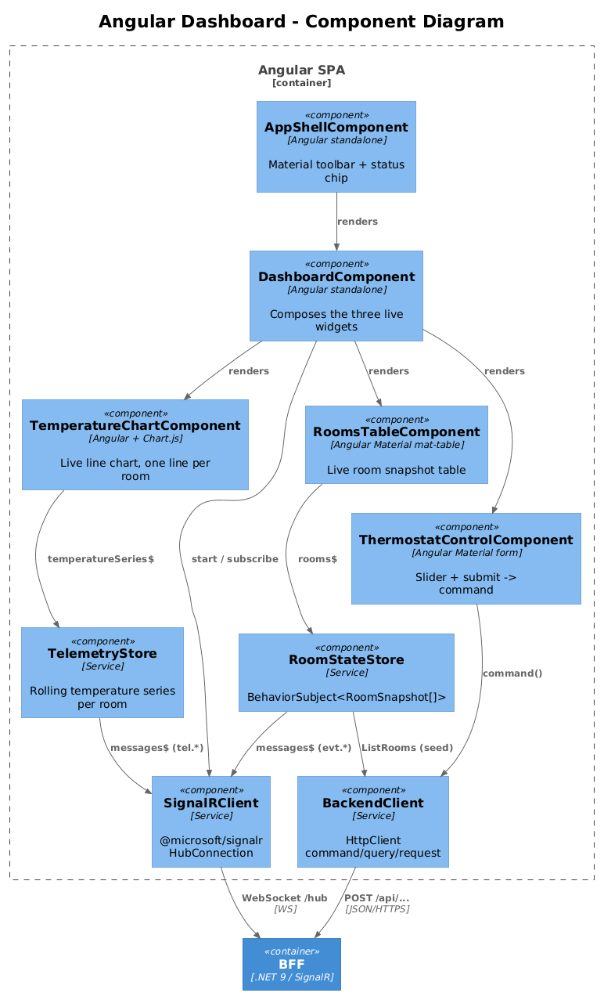
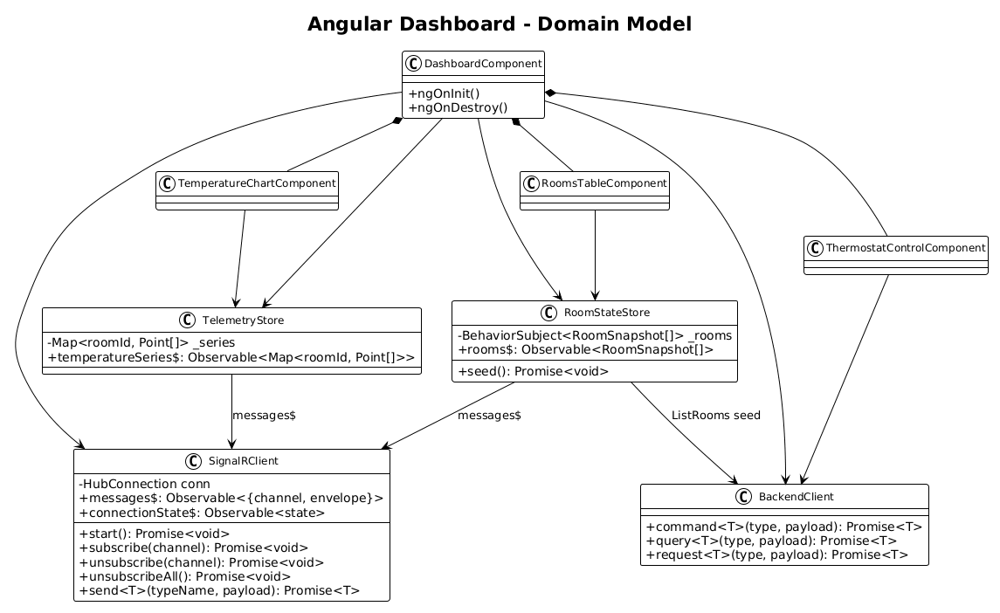
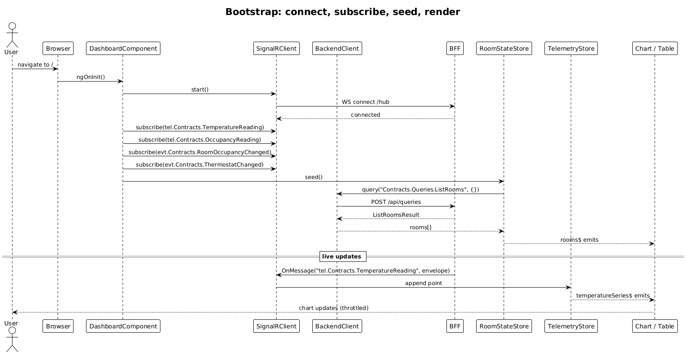
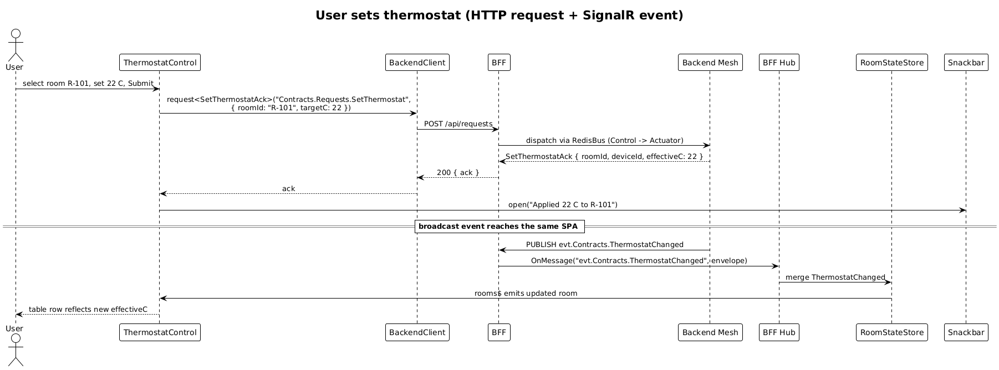

# Frontend Application — Angular Dashboard — Detailed Design

**Status:** Draft

## 1. Overview

A single-page Angular application that connects to the [BFF (Feature 04)](../04-bff-service/README.md) and presents the [Smart Building reference app's](../02-reference-application/README.md) data through a dark-themed Material UI dashboard. The frontend is a teaching tool: it exists to demonstrate that the five message patterns are usable end-to-end from a real browser client.

**Visual source of truth:** Every screen, component, color, spacing, and typography token is designed first in [`docs/ui-design.pen`](../../ui-design.pen) — a Pencil design document opened only via the Pencil MCP tools (`open_document`, `batch_get`, `get_screenshot`, …). The Angular implementation tracks that file: design changes flow `ui-design.pen` → code, never the other way around. The `/ui-audit` workflow compares the running app against `ui-design.pen` and fixes any deviation.

**Scope:**
- One dashboard page. No router-driven multi-page app.
- Live telemetry charts (Chart.js).
- Live room status table (Angular Material table).
- Thermostat control (Material form → command via BFF).
- Connection status indicator.

**Out of scope:** Authentication, multi-user routing, internationalization, mobile-specific layouts.

**Tech:**
- **Angular** (latest LTS, standalone components, signals where natural).
- **Angular Material** with a prebuilt **dark** theme.
- **Chart.js** (used directly — no `ng2-charts` wrapper, to keep the dependency graph small).
- **`@microsoft/signalr`** for the WebSocket connection to the BFF hub.
- **`HttpClient`** for HTTP commands / queries / requests.

## 2. Workspace Layout

The frontend is an **Angular multi-project workspace** at `frontend/`. Three projects, each with its own `tsconfig` and build target, all wired together through `angular.json` and the workspace-level `tsconfig.json` `paths` map:

```
frontend/
├── angular.json
├── package.json
├── tsconfig.json                           # paths: api → dist/api, components → dist/components
└── projects/
    ├── api/                                # library — backend models, contracts, DI tokens, implementations
    │   └── src/
    │       ├── lib/
    │       │   ├── models/                 # TS interfaces mirroring .NET Contracts records
    │       │   ├── contracts/              # IBackendClient, ISignalRClient, IRoomStateStore, ITelemetryStore
    │       │   ├── tokens/                 # BACKEND_CLIENT, SIGNALR_CLIENT, ROOM_STATE_STORE, TELEMETRY_STORE
    │       │   └── implementations/        # BackendClient, SignalRClient, RoomStateStore, TelemetryStore
    │       └── public-api.ts               # exports models, contracts, tokens, and impls
    ├── components/                         # library — reusable presentation components built from ui-design.pen
    │   └── src/
    │       ├── lib/
    │       │   ├── app-shell/              # toolbar + connection-status chip
    │       │   ├── temperature-chart/      # Chart.js line-chart wrapper
    │       │   ├── rooms-table/            # mat-table wrapper
    │       │   └── thermostat-control/     # form: room selector + slider + submit button
    │       ├── styles/
    │       │   └── _tokens.scss            # color, spacing, typography vars mirrored from ui-design.pen
    │       └── public-api.ts
    └── smart-building-demo/                # application — the SPA itself
        └── src/
            └── app/
                ├── app.config.ts           # provides the api lib's tokens with concrete implementations
                ├── app.routes.ts
                └── dashboard/              # smart container — injects via tokens, composes components/* widgets
```

**Why a multi-project workspace:**
- The `api` library is the only place that touches `HttpClient` / `@microsoft/signalr`. It is the wire-protocol layer, reusable from any future Angular app that talks to this BFF.
- The `components` library is **pure presentation** — `@Input` / `@Output` only, no service injection, no knowledge of the backend. It is built directly from `docs/ui-design.pen` and is reusable in Storybook, design-system docs, or another app shell.
- The `smart-building-demo` app is the only place that knows the wiring: it provides the api implementations against the tokens and composes the dashboard from `components/*` widgets.

### 2.1 `components` library — built from `docs/ui-design.pen`

Pure presentation components with no knowledge of the backend or stores. Each takes its data via `@Input` and emits user actions via `@Output`. Visual fidelity is owned by `docs/ui-design.pen`:

- All colors, font sizes, line heights, and spacing tokens are defined as variables in `ui-design.pen` and mirrored in `projects/components/src/styles/_tokens.scss`. When a token changes in the .pen file, the SCSS file is updated to match — by hand or via a future export step.
- Component layouts, states, and interaction patterns are taken from the corresponding nodes in the .pen file.

| Component | Inputs | Outputs |
|---|---|---|
| `AppShellComponent` | `title: string`, `connectionState: 'connected' \| 'reconnecting' \| 'disconnected'` | `<ng-content>` for page body |
| `TemperatureChartComponent` | `series: Map<roomId, Point[]>` | — |
| `RoomsTableComponent` | `rooms: RoomStatus[]` | — |
| `ThermostatControlComponent` | `rooms: RoomStatus[]` | `submit: EventEmitter<{ roomId: string; targetC: number }>` |

Because these components depend only on Inputs and Outputs, they can be exercised in isolation with hand-built fakes — no DI, no HTTP, no SignalR — which is exactly what the .pen-driven design review needs.

### 2.2 `api` library — contracts, tokens, implementations

Owns the entire wire-protocol layer: data models, service contracts, dependency-injection tokens, and concrete service implementations. The application never imports concrete service classes; it injects them through tokens.

#### 2.2.1 Service contracts (TypeScript interfaces)

There is one **public interface contract per service**. All four are exported from `public-api.ts`.

```ts
// projects/api/src/lib/contracts/backend-client.contract.ts
export interface IBackendClient {
  command<T>(type: string, payload: object): Promise<T>;
  query<T>(type: string, payload: object): Promise<T>;
  request<T>(type: string, payload: object): Promise<T>;
}

// projects/api/src/lib/contracts/signalr-client.contract.ts
export interface ISignalRClient {
  start(): Promise<void>;
  subscribe(channel: string): Promise<void>;
  unsubscribe(channel: string): Promise<void>;
  unsubscribeAll(): Promise<void>;
  send<T>(typeName: string, payload: object): Promise<T>;
  readonly messages$: Observable<{ channel: string; envelope: unknown }>;
  readonly connectionState$: Observable<'connected' | 'reconnecting' | 'disconnected'>;
}

// projects/api/src/lib/contracts/room-state-store.contract.ts
export interface IRoomStateStore {
  readonly rooms$: Observable<RoomStatus[]>;
  seed(): Promise<void>;
}

// projects/api/src/lib/contracts/telemetry-store.contract.ts
export interface ITelemetryStore {
  readonly temperatureSeries$: Observable<Map<string, Point[]>>;
}
```

#### 2.2.2 Injection tokens

```ts
// projects/api/src/lib/tokens/index.ts
export const BACKEND_CLIENT     = new InjectionToken<IBackendClient>('BACKEND_CLIENT');
export const SIGNALR_CLIENT     = new InjectionToken<ISignalRClient>('SIGNALR_CLIENT');
export const ROOM_STATE_STORE   = new InjectionToken<IRoomStateStore>('ROOM_STATE_STORE');
export const TELEMETRY_STORE    = new InjectionToken<ITelemetryStore>('TELEMETRY_STORE');
```

#### 2.2.3 Concrete implementations

`@Injectable()` classes that implement the contracts. They ship from the same library so an app can `provide` them with one import. Apps may substitute their own implementation (e.g. a `FakeBackendClient` for tests, Storybook, or .pen-driven previews) without changing any consumer.

#### 2.2.4 App-side wiring (Injection Token pattern)

`smart-building-demo/src/app/app.config.ts` registers the implementations against the tokens:

```ts
import { ApplicationConfig } from '@angular/core';
import { provideHttpClient } from '@angular/common/http';
import {
  BACKEND_CLIENT,    BackendClient,
  SIGNALR_CLIENT,    SignalRClient,
  ROOM_STATE_STORE,  RoomStateStore,
  TELEMETRY_STORE,   TelemetryStore,
} from 'api';

export const appConfig: ApplicationConfig = {
  providers: [
    provideHttpClient(),
    { provide: BACKEND_CLIENT,   useClass: BackendClient   },
    { provide: SIGNALR_CLIENT,   useClass: SignalRClient   },
    { provide: ROOM_STATE_STORE, useClass: RoomStateStore  },
    { provide: TELEMETRY_STORE,  useClass: TelemetryStore  },
  ],
};
```

Consumers inject by token, **not** by class. They see only the interface:

```ts
class DashboardComponent {
  private readonly backend   = inject(BACKEND_CLIENT);    // typed as IBackendClient
  private readonly signalR   = inject(SIGNALR_CLIENT);    // typed as ISignalRClient
  private readonly rooms     = inject(ROOM_STATE_STORE);  // typed as IRoomStateStore
  private readonly telemetry = inject(TELEMETRY_STORE);   // typed as ITelemetryStore
}
```

This is the **Injection Token pattern**. Two consequences:

1. **The application depends on contracts, not concretions.** `DashboardComponent` references `IBackendClient` only — Angular swaps in the concrete `BackendClient` at runtime. If the implementation is replaced (HTTP/2 client, mock client, alternate transport), the application code is unchanged.
2. **Tests and design-time previews can swap an implementation in one line.** A spec file or a Storybook story overrides `{ provide: BACKEND_CLIENT, useClass: FakeBackendClient }` and gets the same component tree under deterministic data — useful for matching screenshots against `ui-design.pen`.

## 3. Architecture

### 3.1 C4 Context



### 3.2 C4 Container

The Angular SPA is a single browser-side container, but is structured internally as three workspace projects. The BFF and Redis sit on the other side.



### 3.3 C4 Component

Internal Angular pieces, split across the three projects: presentation in `components`, data layer in `api`, wiring + container components in `smart-building-demo`.



## 4. Component Details

### 4.1 `AppShellComponent` (`components` library)
- Material toolbar (app title, connection status indicator) projecting page body via `<ng-content>`.
- Pure presentation — `[connectionState]` input drives the chip color. No service injection.
- Layout, colors, and chip variants are taken directly from `ui-design.pen`.

### 4.2 `DashboardComponent` (`smart-building-demo` app — container)
- Container component. Composes the three presentation widgets from the `components` library.
- Injects `BACKEND_CLIENT`, `SIGNALR_CLIENT`, `ROOM_STATE_STORE`, and `TELEMETRY_STORE` and binds their observables onto the children's `[input]` props (`async` pipe / signals).
- On init: calls `signalR.start()`, subscribes to the four channels the dashboard cares about, and seeds room state by awaiting `rooms.seed()`.
- Handles the `(submit)` from `ThermostatControlComponent` by calling `backend.request<SetThermostatAck>("Contracts.Requests.SetThermostat", …)` and toasting the result.

### 4.3 `TemperatureChartComponent` (`components` library)
- Chart.js line chart, **one line per room**, time on the x-axis, °C on the y-axis. Rolling 5-minute window (matching the aggregator's window in Feature 02).
- Re-renders reactively from `[series]`. Throttles re-renders to at most one per 250 ms.

### 4.4 `RoomsTableComponent` (`components` library)
- Material `mat-table` with columns: **Room**, **Name**, **Temperature (°C)**, **Occupied**, **Last Updated**.
- Data comes from `[rooms]`. Occupancy is shown as a colored Material chip per the .pen design.

### 4.5 `ThermostatControlComponent` (`components` library)
- Material form: room selector + slider (15–28 °C).
- On submit, emits `(submit)` with `{ roomId, targetC }`. The container component is responsible for the actual `IBackendClient.request` call and the resulting toast.

### 4.6 `SignalRClient` (`api` library — implements `ISignalRClient`)
Owns the singleton `HubConnection` to `/hub`. Auto-reconnects via `withAutomaticReconnect()`. Exposes:
- `subscribe(channel: string): Promise<void>`
- `unsubscribe(channel: string): Promise<void>`
- `messages$: Observable<{ channel: string; envelope: unknown }>` — multicast stream of every received message.
- `send<TResponse>(typeName: string, payload: object): Promise<TResponse>` — alternative to `IBackendClient` for command / query / request over SignalR.
- `connectionState$: Observable<'connected' | 'reconnecting' | 'disconnected'>` — drives the toolbar status chip via `AppShellComponent.connectionState`.

### 4.7 `BackendClient` (`api` library — implements `IBackendClient`)
HTTP wrapper over `HttpClient` for command / query / request:
- `command<T>(type: string, payload: object): Promise<T>` → `POST /api/commands`
- `query<T>(type: string, payload: object): Promise<T>` → `POST /api/queries`
- `request<T>(type: string, payload: object): Promise<T>` → `POST /api/requests`

Surfaces 4xx/5xx responses as typed errors so the UI can show a Material snackbar.

### 4.8 `RoomStateStore` (`api` library — implements `IRoomStateStore`)
- Holds the canonical room snapshot. Subscribes to `ISignalRClient.messages$` filtered to `evt.*` and merges updates into a `BehaviorSubject<RoomStatus[]>`.
- Initial seed (`seed()`) calls `IBackendClient.query("Contracts.Queries.ListRooms", {})`.
- Depends on `BACKEND_CLIENT` and `SIGNALR_CLIENT` via DI — i.e. it depends on the **contracts**, not on the concrete `BackendClient` / `SignalRClient` classes.

### 4.9 `TelemetryStore` (`api` library — implements `ITelemetryStore`)
- Holds rolling temperature points per room, capped at the last 5 minutes.
- Subscribes to `ISignalRClient.messages$` filtered to telemetry channels and appends each `TemperatureReading` to that room's series.

### 4.10 Subscription policy on startup

`DashboardComponent.ngOnInit` subscribes to:

```
tel.Contracts.TemperatureReading
tel.Contracts.OccupancyReading
evt.Contracts.RoomOccupancyChanged
evt.Contracts.ThermostatChanged
```

`ngOnDestroy` calls `ISignalRClient.unsubscribeAll()`. Subscriptions are tied to component life, not page life — if the dashboard ever lives behind a router, navigating away cleanly drops the topics.

## 5. Data Model

### 5.1 TypeScript records (`api` library — `models/`)

Mirror the .NET Contracts records as TypeScript interfaces. Hand-maintained — small enough that codegen would be overkill. Exported from `api/public-api.ts`.

```ts
interface TemperatureReading      { sensorId: string; roomId: string; celsius: number; at: string; }
interface OccupancyReading        { sensorId: string; roomId: string; occupied: boolean; at: string; }
interface RoomOccupancyChanged    { roomId: string; occupied: boolean; at: string; }
interface ThermostatChanged       { deviceId: string; roomId: string; effectiveC: number; at: string; }
interface RoomStatus              { roomId: string; name: string; temperatureC: number | null; occupied: boolean; lastUpdated: string | null; devices: string[]; }
interface SetThermostat           { roomId: string; targetC: number; }
interface SetThermostatAck        { roomId: string; deviceId: string; effectiveC: number; }
```

### 5.2 Class Diagram

The interface contracts, concrete implementations, injection tokens, and the components / app that consume them.



## 6. Key Workflows

### 6.1 Page load → connect → subscribe → render



### 6.2 User changes thermostat

A request flow that uses HTTP for the command and SignalR for the resulting `ThermostatChanged` event broadcast.



## 7. UI / UX

### 7.1 Source of truth: `docs/ui-design.pen`

Every screen, component, color, font, and spacing value in the dashboard is defined in `docs/ui-design.pen`. The Angular implementation tracks that file:

- The `components` library imports tokens from `_tokens.scss`, which is a hand-mirror of the variables defined in the .pen file.
- Component layouts, states (hover, focus, disabled, error), and interaction patterns are taken from the corresponding nodes.
- When a layout or token changes, it changes in `ui-design.pen` first; the SCSS and Angular templates are updated to match.
- The `/ui-audit` workflow compares the running app to `ui-design.pen` and fixes any deviation. Design drift is a bug.

### 7.2 Layout

A single-column dashboard. Material toolbar at the top, three stacked panels:

1. **Temperature chart** — full-width Chart.js line chart, one colored line per room, smooth bezier curves, ~5-minute rolling window, animated point-add.
2. **Rooms table** — Material table, dense rows, occupancy shown as a colored Material chip (green = occupied, gray = empty).
3. **Thermostat control** — compact card with room dropdown + slider + submit button.

### 7.3 Theme

Angular Material's prebuilt **dark** theme (e.g. `cyan-orange` from `@angular/material/prebuilt-themes/`, or a custom theme via `mat.define-dark-theme()`) configured to match the variables exported from `ui-design.pen`. Background near-black; primary cyan/teal; accents amber/orange to make active chart lines pop. Material's `density-2` for the table to keep rows compact.

### 7.4 Connection status

Toolbar right-corner Material chip:
- **Live** (green) when SignalR is connected.
- **Reconnecting…** (amber) during transient disconnects.
- **Offline** (red) on terminal failure.

Driven by `ISignalRClient.connectionState$`, fed into `[connectionState]` on `AppShellComponent`.

## 8. Open Questions

- **Codegen for TypeScript contracts.** Hand-maintained is fine for the demo (~10 records). If the message catalog grows, a `dotnet typegen` step or `NSwag`-from-OpenAPI is warranted. Output would live in `projects/api/src/lib/models/`.
- **Codegen for SCSS tokens from `ui-design.pen`.** Currently `_tokens.scss` is a hand-mirror of the .pen variables. A `pencil export` step that emits SCSS would remove the drift risk.
- **Single dashboard vs. per-room drill-down.** Out of scope; would be added later behind the Angular router.
- **Chart libraries.** Chart.js is sufficient for line charts. If candlesticks / heatmaps are needed, swap to ECharts.
- **State management library.** Plain RxJS subjects are sufficient at this size. NgRx or `signalStore` would be considered if the store graph grows past a handful of slices.
